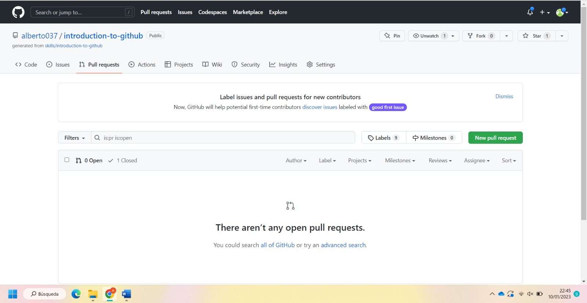

# UDGit A1. Introducción a GitHub
Realiza el siguiente curso diseñado por el equipo de formación de GitHub. Forma parte de un conjunto de cursos interactivos diseñados para principiantes en el uso de GitHub. Te presentamos en el desarrollo colaborativo mediante GitHub: una herramienta de control de versiones. Trabajarás con un repositorio de prueba sobre el que realizarás unos pasos clave.

Entrega un pantallazo que demuestre que lo ha finalizado y responde a las siguientes preguntas:

- Busca en Wikipedia e indica:
Qué es GitHub y su relación con Git
Compañía dueña de GitHub

GitHub es un sitio "social coding". Te permite subir repositorios de código para almacenarlo en el sistema de control de versiones Git.

La compañía es Microsoft
- Qué es una rama en el código

Es una versión del código del proyecto sobre el que estás trabajando.
- Qué es una nueva característica en el código

Un tipo de rama auxiliar el sistema que se encarga de la gestión de las características, historias de usuario o requisitos en la plataforma de control de versiones.
- Qué es una solicitud de extracción

Los pull request permiten no solo llevar de forma más ordenada las tareas en la etapa del desarrollo, sino también crear propuestas o cambios que puedan ser integrados posteriormente a dicho proyecto.
- Qué es un merge

Permite tomar las líneas independientes de desarrollo creadas por git branch e integrarlas en una sola rama.
- Qué es un problema

Un problema identificado en un proyecto es algo que actualmente está sucediendo y que tiene un efecto negativo en la entrega del proyecto.
- Qué es una mención y qué implica

- Qué es una etiqueta y por qué su uso

Permite dar un título o descripción a cada campo del formulario, además al usar esta etiqueta hacemos que el formulario sea más fácil de usar
- Qué son las notificaciones. Indica las tres opciones de notificaciones

- Qué son GitHub Pages

Es un servicio de alojamiento de sitio estático que toma archivos HTML, CSS y JavaScript directamente desde un repositorio en GitHub, opcionalmente ejecuta los archivos a través de un proceso de complilación y publica un sitio web.
- Qué es GitHub Flow

Se define como un sistema de flujo de trabajo que se centra en los procesos de ramificación y que permite realizar implementaciones regulares en los proyectos, contribuyendo así a garantizar la entrega continua.